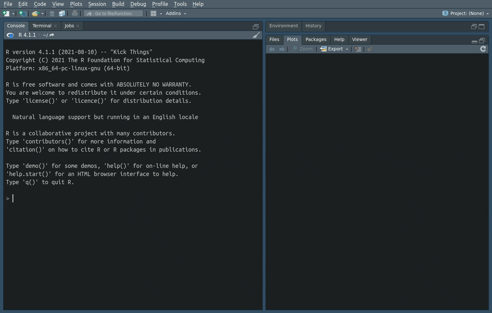

# woRdle

Bringing the [wordle](https://www.powerlanguage.co.uk/wordle/) experience to `R` (until the NYT sues us).

## Installation

```
library(devtools)
install_github("mvevans89/woRdle")
```

## How to play

```
libray(woRdle)
play_woRdle() #default is today's word
```

Gameplay is the same as in the original, and your guesses will show up in the Plot Viewer. 

**Green**: correct letter in the correct spot </br>
**Yellow**: correct letter in the wrong spot </br>
**Gray**: incorrect letter

It will by default play today's word, but other day's can be access by entering the date in `Date` format, with 2022-02-01 the earliest date available. Example: `play_woRdle(as.Date("2022-05-06"))`



Complete with scores in ASCII format!

```
"woRdle #2 : 4/6"
  _   _   _   _   _ 
 |.| |.| |.| |.| |.| 
  _   _   _   _   _ 
 |O| |/| |.| |.| |/| 
  _   _   _   _   _ 
 |.| |/| |O| |O| |O| 
  _   _   _   _   _ 
 |O| |O| |O| |O| |O| 
 ```

## To contribute

Feel free to submit issues and PR's if you'd like to contribute. This was made in all the haste of a rabid wordle player so there is much to be improved!
